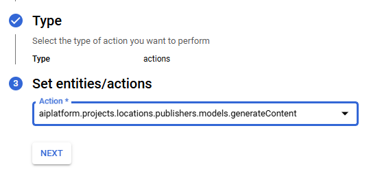

# Webhook Trigger

In this demo, we will use the Vertex AI trigger to call Gemini with a prompt.

## Create Webhook Trigger

1. In the Google Cloud console, go to the Application Integration page. [Go to Application Integration](https://console.cloud.google.com/integrations)
2. In the navigation menu, click Integrations. The Integrations List page appears listing all the integrations available in the Google Cloud project.
3. Create an integration called "CallGemini".


To configure the **VertexAI Connector**, drag and drop the vertex AI connctor from the "TASKS" dropdown and click "Configure Connector".

## Configure the Vertex AI Connection

To configure the Vertex AI connection, perform the following steps
1. Click "Create Connection".


2. Create the connection according to the information in the following screenshots:


Note: The hostname is https://yourregion-aiplatform.googleapis.com/


3.  With the Connection created, let's create our integration flow

Go back to the integration, and click "Configure Connector" again. 

Choose the newly created Vertex connection


Configure the connection as per the follwoing screenshot:


Back in the integration canvas, drag and drop an API trigger and a "Data Mapping" task into the canvas, and connect them, and change the connector taskname to "InvokeGemini"


4.  Configure the Data Mapper
Open the "Data Mapping task". Create two variable as shown in the screenshots:


The value for the "model" variable is "projects/<project_id>/locations/europe-west4/publishers/google/models/gemini-1.5-pro". In this example, we are using Gemini, however, you can choose any model deployed on Vertex AI.

Drag and drop the "connectorInputPayload->Path parameterers->model" to the first row output. Drag and drop the "connectorInputPayload->RequestBody->contents" to the second row output.


Now, let's configure the inputs.
In the input for the first row, drag and drop the "model variable". 
In the input for the second row, concatenate the following: 
1. [{"role": "user","parts": [{"text": " (note: the string is not enclosed by quotation marks, copy and paste the exact string)


2. prompt (the variable created earlier)


3. "}]}] (note: the string is not enclosed by quotation marks, copy and paste the exact string)


4. Add the function "TO_JSON()"


5. Exit the data mapper

## Configure the Response from Gemini

In the integration flow canvas, create a variable called "Output". It will hold the output from Gemini and return the output back to the caller of the integration


To parse Gemini's response, we will use the "Data Transformer" task. Drag and drop a "Data Transformer" task and connect it at the end.

Open the "Data Transformer" task, click "Script" at the top-right corner, delete the existing script, and paste the following:


```

// Import the additional functions library
local f = import "functions";

local geminiOutput = std.parseJson(std.extVar('`Task_1_connectorOutputPayload`')[0].ResponseBody);

{
 output: geminiOutput.candidates[0].content.parts[0].text,
}

```
