# JIRA Trigger

This lab will cover the steps to create a sample integration using a JIRA trigger Some other Integration Concepts covered in this exercise include -
- Create a Data mapping
- Configure an email task to send an email

## Overview

You will create an integration with a JIRA trigger to get updates about a new JIRA issue being created. After getting the notification about a JIRA issue being created, the integration sends an email notifying a user about the creation of the issue. This lab builds on top of the "pub-sub-trigger-Jira Connector" lab in this repo. If you have not completed the "pub-sub-trigger-Jira Connector" lab, please complete it first since we would be reusing artifacts from that lab. 

## Before you begin

Ensure your IAM user has the following GCP roles/permissions in your Google Cloud project.
- Application Integration Invoker

## Create an event subscription in the previously create JIRA connection

The JIRA connection created previoulsy has to be enbaled with an event subscription.

1. Go to the connections page, click the previouly created JIRA connection and click "EDIT at the top"
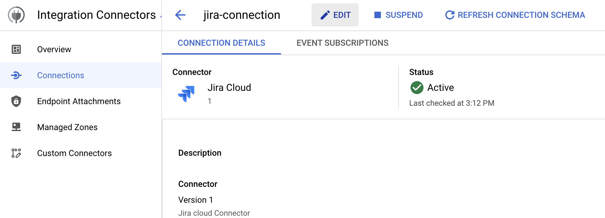

2. Scroll down to the "Event Subscription details" section and fill in the host, username and API Token.
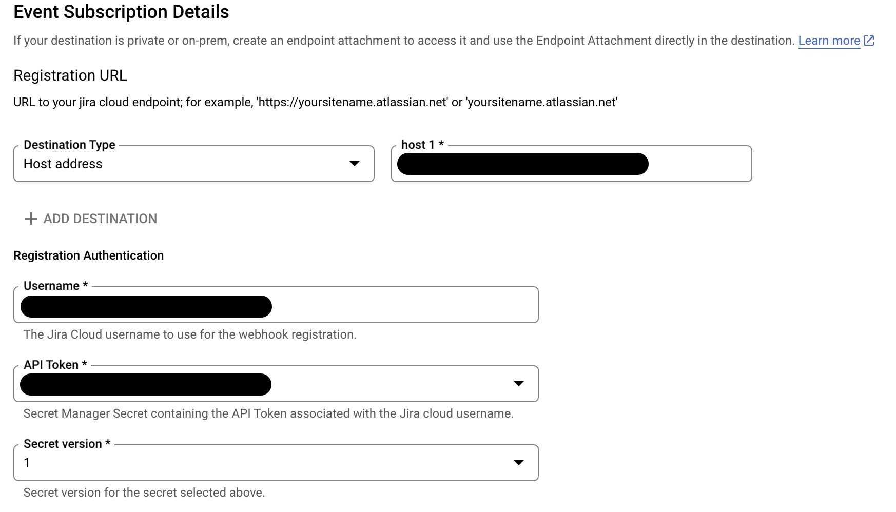

3. Click "SAVE" at the bottom and wait for the connection to activate.

## Create a New Integration

Create a new integration by  performing the following steps:

1. In the Google Cloud console, go to the Application Integration page.
2. In the navigation menu, click Integrations. The Integrations List page appears.
3. Click **Create** integration.
4. Enter a name and description in the Create Integration dialog. For example, `JIRA-Trigger`. 
5. Select a region for the integration
6. Click Create to open the integration editor

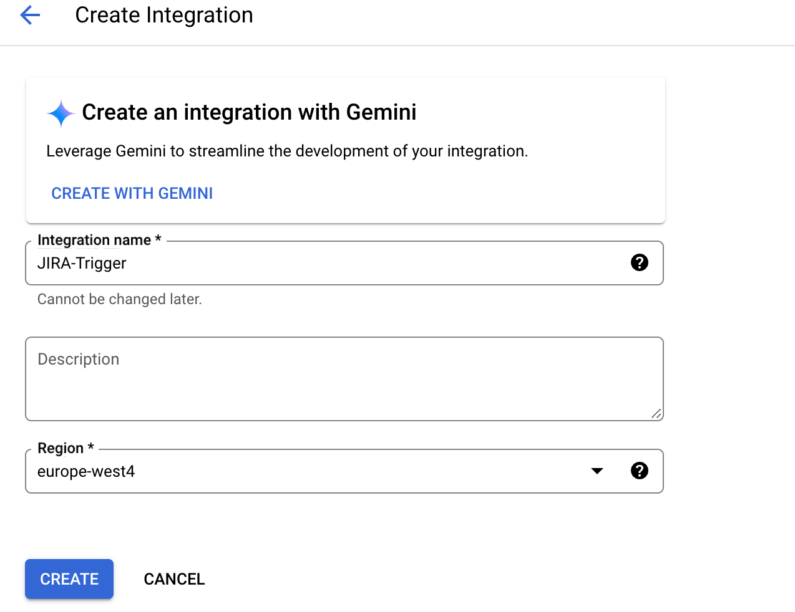

## Create and Configure a JIRA trigger

To add a Cloud JIRA trigger to the integration, follow the steps below:
1. In the integration editor, select Triggers to display a list of available triggers.
2. Click and place the Cloud JIRA trigger element to the designer.
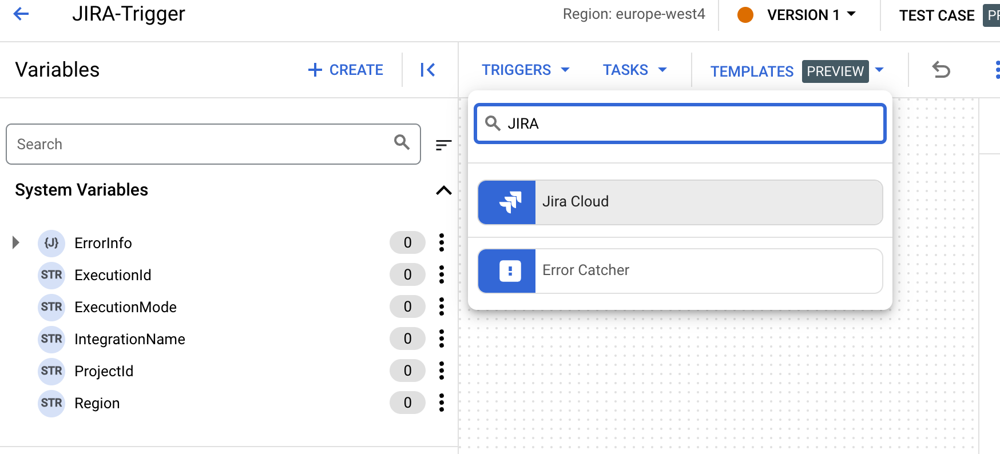

3. Click on the element, and click the "CONFIGURE JIRA CLOUD TRIGGER" button in the integration editor to view the trigger configuration pane.
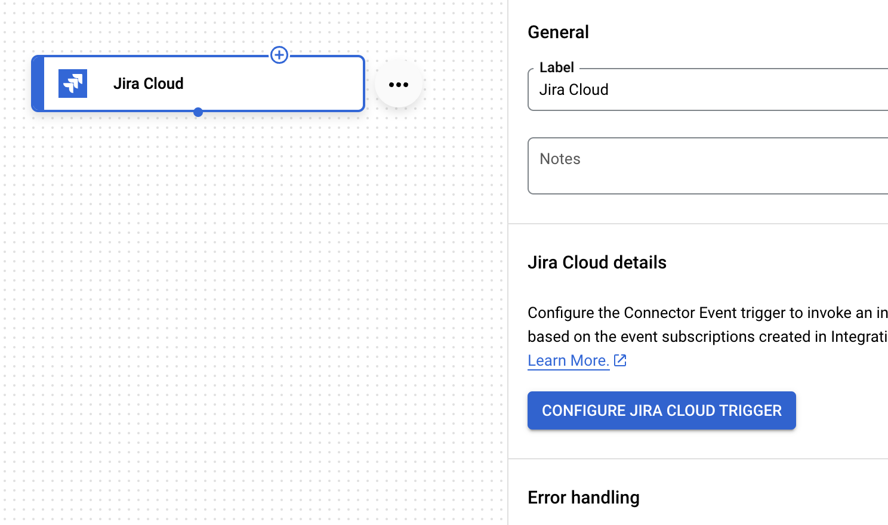

4. Specify the details as per the following screenshot. Re-use the JIRA connection created previoulsy. In the "Event Type Id" field, multiple events are available, such as addition of a comment, deletion of an issue etc. IN this lab, we will use the creation of an issue to trigger the integration.

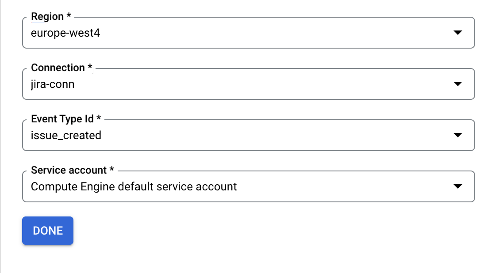

## Create the EMAIL task

1. Go to "TASKS" drowdown at the top, search for "email", and drag and drop the "Send Email" task into th canvas.
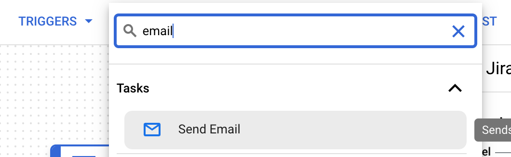
2. Select the newly-created Email task, and configure the "To" and "Subject" fields. provide your email ID in the "To" fields and the string "New JIRA issue created" in the "Subject" field. 
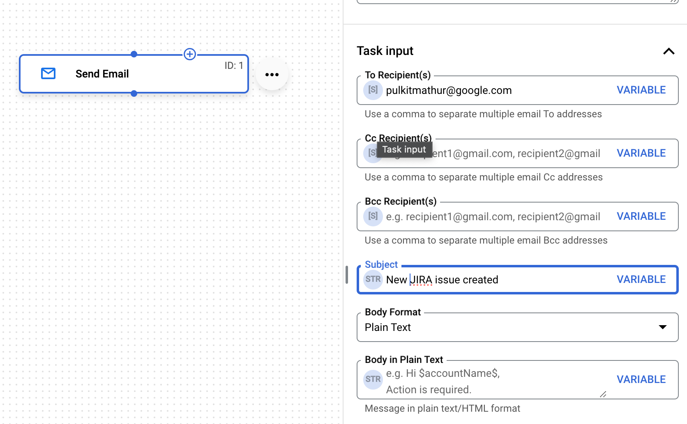
3. Connect both tasks with an arrow, and publish the integration. Your final integration should look like the below:
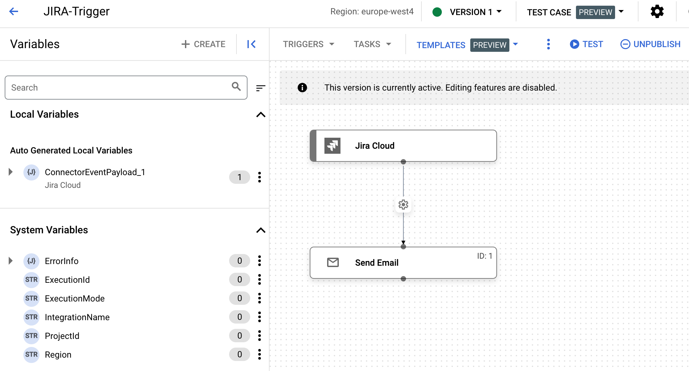

### Test the integration
1. Go to your JIRA board, and create a new issue.
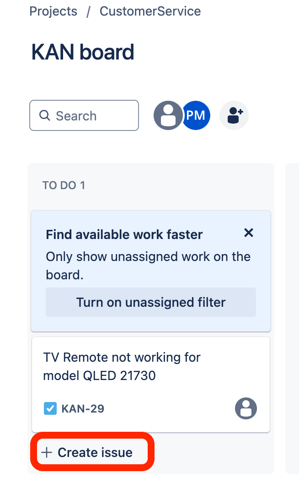
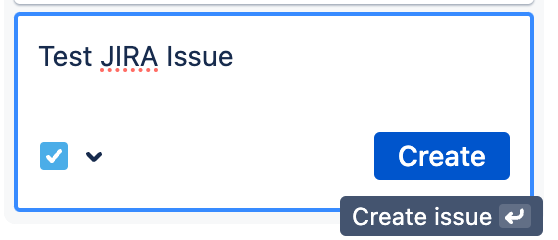

2. You should see a new execution of the integration in the logs, and email being received at the email address you provided earlier.

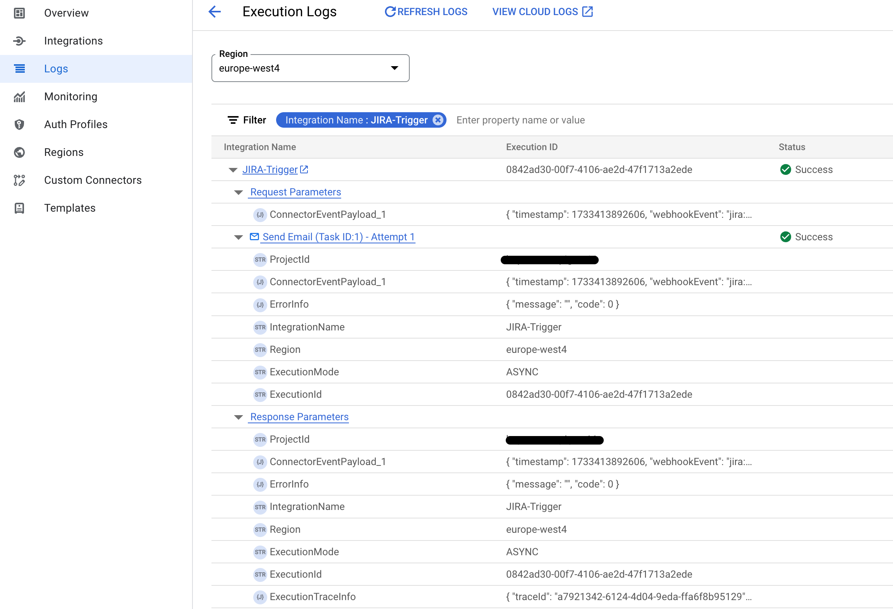