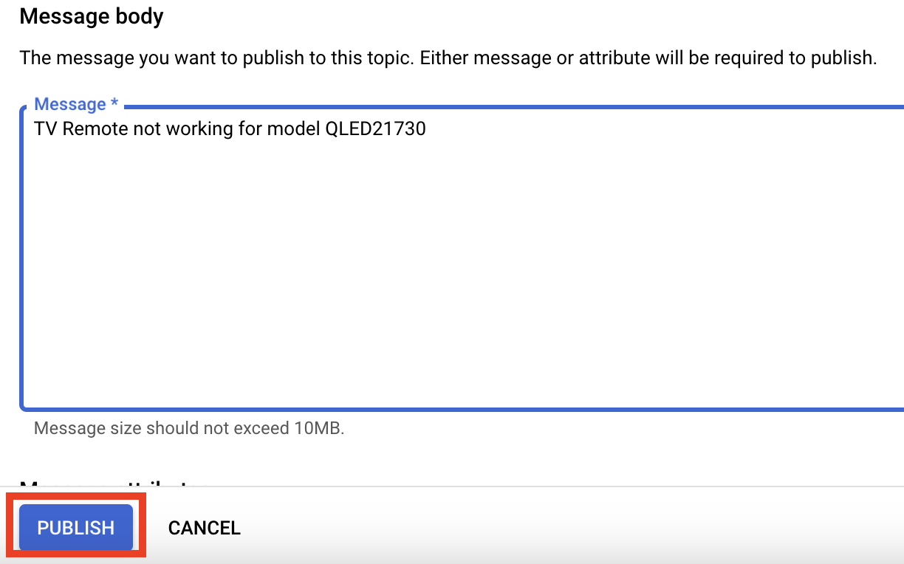

# Pub/Sub Trigger, Data Mapping and JIRA insert

This lab will cover the steps to create a sample integration using Application Integration and the Cloud Pub/Sub trigger. Some other Integration Concepts covered in this exercise include -
- Create & Configure a Cloud Pub/sub Trigger
- Configure tasks, variables
- Create a Data mapping
- Create an Integration
- Create a JIRA connection
- Insert an "issue" into JIRA

## Overview

You will create an integration with a Cloud Pub/Sub trigger to listen to an existing Pub/Sub topic that receives issue information. This issue information would be transformed to JIRA's format using data mapper and an issue in JIRA would be created. 

## Before you begin

Ensure your IAM user has the following GCP roles/permissions in your Google Cloud project.
- Pub/Sub Editor
- Application Integration Invoker

## Set up environment

For this lab, we will create a Pub/Sub topic:
1.  Go to the Pub/Sub topics page in the Cloud console
2.  Click Create a topic. 
3.  In the Topic ID field, provide a unique topic name.
4.  Click Create
5. In the next screen which appears, note down the path to the topic

## Create a New Integration

Create a new integration by  performing the following steps:

1. In the Google Cloud console, go to the Application Integration page.
2. In the navigation menu, click Integrations. The Integrations List page appears.
3. Click **Create** integration.
4. Enter a name and description in the Create Integration dialog. For example, `PubSubtoJIRA`. Replace the prefix with an appropriate value similar to the prefix you used in the above step while creating the Topic
5. Select a region for the integration
6. Click Create to open the integration editor

## Create and Configure a Cloud Pub/Sub trigger

To add a Cloud Pub/Sub trigger to the integration, follow the steps below:
1. In the integration editor, select Triggers to display a list of available triggers.
2. Click and place the Cloud Pub/Sub trigger element to the designer.
3. Click the Cloud Pub/Sub trigger element in the integration editor to view the trigger configuration pane.
4. Specify the topic the trigger should listen to in the Pub/Sub topic field - `projects/{projectID}/topics/`
5. Select an existing service account or create a new service account. Click the **GRANT** button to assign the appropriate permissions
6. See screenshot below

## Create the JIRA connector

1. Go to "TASKS" drowdown at the top, search for "connector" and drag and drop a connector into the canvas.

2. Select the newly-created connector task, and click the button "Configure Connector"

3. Click "Create Connection".

4. Select JIRA, and configure section 1, Connection details as per the following screenshot:

5. Configure section 2 as per the following screenshot. (note: enter the JIRA hostname from your own account, or provided by the instructor if you are performing this lab with the help of an instructor)

6. Configure section 3 as per the following screenshot.(note: enter the JIRA user from your own account, or provided by the instructor if you are performing this lab with the help of an instructor)

Click on "Create New Secret" as per the following screnshot, and enter your JIRA API key in the field for "Secret Value", and click "Create Secret". If you are asked to grant access to this secret to the service account, click "Grant".

7. Finally, click "Create" to start the provisioning of the connection. After a few minutes, the connection should be created.

## Finish configuring the integration

1. Go back to the integration, and click on the "connector" task, and click again "Configure Connector" on the right panel.

2. Configure the connector according to the following values. We will create a JIRA issue through this connector.

3. Back in the integration, select the "Data Mapping" task from the TASKS drop-down and drag and drop the task into the canvas. Configure it in the following way:

4. In the first row of the data mapping, click on the text "Variable or Value", and drag and drop the variable CloudPubSubMessage.data from the left. For the output, expand the variable "ConnectorsInputPayload" on the left, find the parameter "Summary", and drag-and-drop it into the output.
 
5. In the second row of the data mapping, enter the string "KAN"(or another value if you are using your own account and using a different name for the JIRA project), and map it to connectorInputPayload.ProjectKey. The JIRA connector needs to know which project the issue would be created in.
 
6. In the third row of the data mapping, enter the string "Task" since we want to create an issue of the type "Task", and map it to connectorInputPayload.IssueTypeName.
 
7. Exit the data mapper and go back to the integration canvas.

### Publish and Test the integration
1. Publish the integration:
 
2. Go to the pub/sub topic, and publish a message through the "Publish Message" button:

3. Publish a message with the content for the issue to be created in JIRA:

4. Go to the integration logs and check the latest integration execution, it should be successful

5. An issue is successfully created in JIRA
