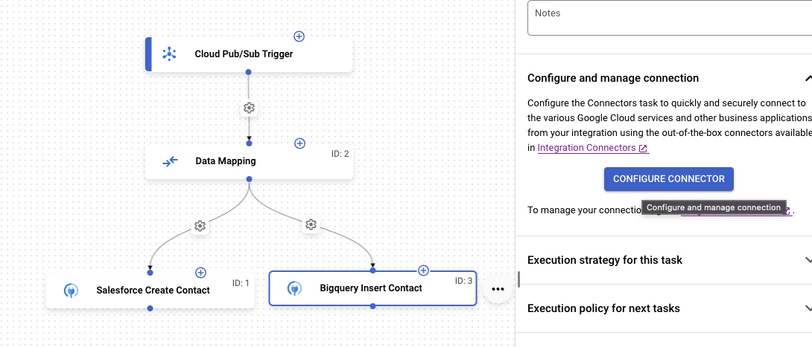
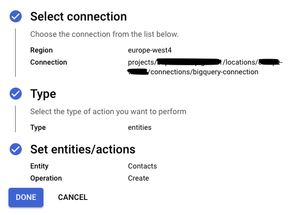

# Pub/Sub Trigger, Data Mapping and Salesforce + Bigquery insert

In this lab, we will extend the previous lab, pub-sub-trigger-Salesforce, to extend the same data in Bigquery as well

## Overview

You will resue the integration previoulsy created and add a Bigquery trigger to insert data into Bigquery.

## Before you begin

Ensure your IAM user has the following GCP roles/permissions in your Google Cloud project.
- Pub/Sub Editor
- Application Integration Invoker

## Set up environment

For this lab, we will create a daatset and table in Bigquery to store contacts. Performt he following actions:
1.  Go to Bigquery in the console and open a query editor.
2. Run the following query, which will create a daatset and table to store contacts within Bigquery:

```
# Create the dataset
CREATE SCHEMA IF NOT EXISTS `ContactDataSet`;

# Create the table within the dataset
CREATE TABLE IF NOT EXISTS `ContactDataSet.Contacts` (
    FirstName STRING(50),
    LastName STRING(50)
);
```


## Open the Integration and create a new Bigquery connector

Performing the following steps:

1. In the Google Cloud console, go to the Application Integration page.
2. In the navigation menu, click Integrations. The Integrations List page appears.
3. Open the integration created in the previous lab(pub-sub-trigger-Salesforce).
4. Create a new connector task, name it to "Bigquery Create Contact" and connect it to the "Data Mapping" task. The updated integration should look like this:


## Configure the Bigquery Connection

To add a Bigquery Connection to the integration, follow the steps below:
1. Select the Bigquery connection task, and click "Configure Connector"

2. Your final connection config should look like this:


3. Go back to the integration, click the task "Bigquery Create Contact" created earlier, click "Configure Connection" and choose the newly created "bigquery-connection" this time. The final confid config should look like the below:



4. Click Done

## Create the Data Mapping for Bigquery

Similar to how we created the data mapping for Salesforce, we will create the data mapping for Bigquery. Notice that an inout variable for Bigquery has already been created by Application Integration.


Create the data mapping for Bigquery. In thr 3rd and 4th row, drag the Bigquery "FirstName" and "LastName" variables to the output. IN the inout section, copy the values from the first 2 rows.


### Test the integration
To test the new integration from the Pub/Sub topics page, do the following steps:
- Go to the Pub/Sub topics page in the Cloud console
- Search for and then select the topic that you created.
- From the "MESSAGES" section of the topic details page, click + Publish Message to open the Publish Message configuration pane.
- In the Message body field, enter:
```
  {
    "Name": "<yourfirstname>",
    "LastName": "<yourlastname>"
  }
```
- Click Publish to publish the message to the topic and trigger your integration.


Upon successful completion, the integration inserts a contact in Salesforce and Bigquery.


