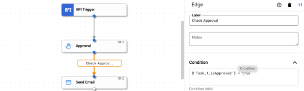
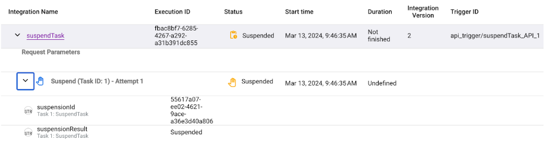

# Approval/Suspend Task

## Create an Approval Task

In this lab, we will demonstrate how Approval tasks can be used for building Approval based workflow.

1. Select an existing integration or click Create integration to create a new one.
If you are creating a new integration:
    - Enter a name `<prefix>-ApprovalTask` and description in the Create Integration panel. The prefix could be your username, ldap, initials, etc
    - Select a region for the integration
    - Click Create
2. This opens the integration in the integration editor
3. In the integration editor navigation bar, click Tasks to view the list of available tasks
4. Click and place the Approval task element in the integration editor
5. Click the Approval task element on the designer to view the Approval task configuration pane
6. Configure the displayed fields using the [Configuration properties](https://cloud.google.com/application-integration/docs/configure-approval-task#params) for the task as detailed in the table. For this demo, update only the Recipient's email address
7. Create API Trigger and join the Approval Task. API Trigger is used to initiate the trigger for Testing purposes
8. Create a Send Email Task and configure the Send Email task with Recipient Email Address and Subject fields as `Approved` and body as `Request Approved`
9. Join the Approval Task with Send Email Task with a Condition ``$`Task_1_isApproved`$ = true`` as shown below 

    

All changes to the properties are saved automatically.

### Publish and Test the execution

- Test using the test button available.  You will receive an email notification. 
- Approve or Reject.
- On Approval, you should receive the email. On Rejection no email is sent.

## Create a Suspend Task

In this lab, we will demonstrate how Suspend tasks can be used to Suspend a workflow and use the manual trigger to unblock the suspension for further workflow processing

1. In the Google Cloud console, go to the Application Integration page. [Go to Application Integration](https://console.cloud.google.com/integrations)
2. In the navigation menu, click Integrations. The Integrations page appears listing all the integrations available in the Google Cloud project
3. Select an existing integration or click Create integration to create a new one. If you are creating a new integration:
   - Enter a name `<prefix>-SuspendTask` and description in the Create Integration pane
   - Select a region for the integration.Note: The Regions dropdown only lists the regions provisioned in your Google Cloud project. To provision a new region, Click Enable Region. See [Enable new region](https://cloud.google.com/application-integration/docs/enable-new-region) for more information
   - Click **Create**
4. This opens the integration in the integration editor
5. In the integration editor navigation bar, click Tasks to view the list of available tasks
6. Click and place the `Suspend task` element in the integration editor
7. Click the Suspend task element on the designer to view the Suspend task configuration pane
8. *(Optional)* Configure the remaining fields using the Configuration properties for the task as detailed in the table
9. Create an API Trigger and Join to the Suspend Task
10. Create a Send email Task and configure the Send Email tasks with following:
    - Recipient Email Address : `your-email-address`
    - Subject :  `Suspend Task Revoked`
    - Body : `Suspend Task Revoked`
    
     

### Publish and Test the execution

1. Get the suspension id & execution id from logs

    

2. Get a Token
    ```sh
    export TOKEN=$(gcloud auth print-access-token)
    ```

3. Revoke Suspension

    The following curl command shows you how to revoke a suspension when you only have the execution ID and the Suspension result variable is set to **Approved**:

    Retrieve the **EXECUTION-ID** from the execution logs and export along with the **PROJECT-ID** and **REGION** into the command below and run in your terminal

    ```sh
    export REGION=
    export EXECUTION_ID=
    export PROJECT_ID=
    ```

    ```sh
    curl -H "Authorization: Bearer $TOKEN" \
    -H "Content-type: application/json" \
    -H X-GFE-SSL: yes \
    -X POST \
    -d '{"suspension_result":"true"}' \
    https://$REGION-integrations.googleapis.com/v1/projects/$PROJECT_ID/locations/$REGION/integrations/-/executions/$EXECUTION_ID/suspensions/-:lift
    ```

    After running the command, the logs should display the following screenshot

    