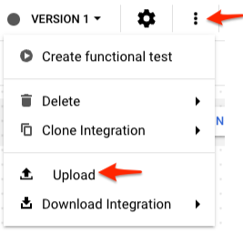
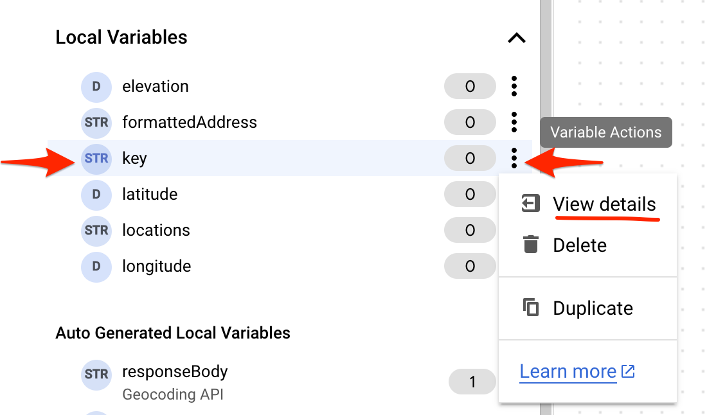
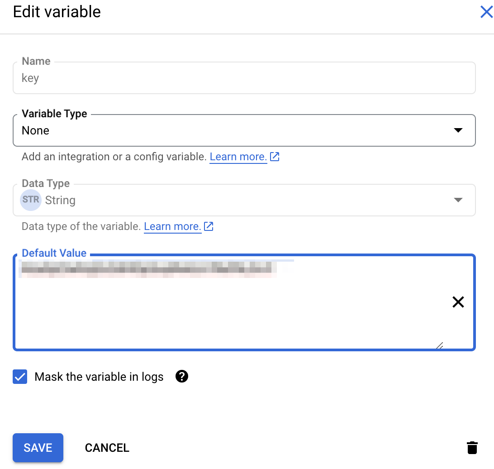
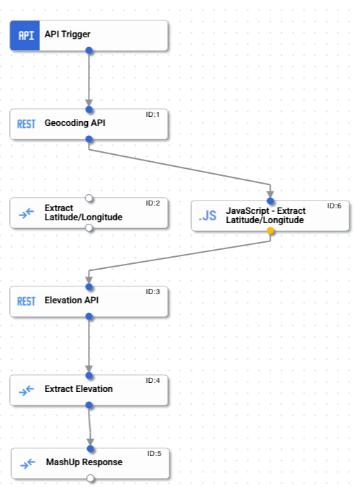
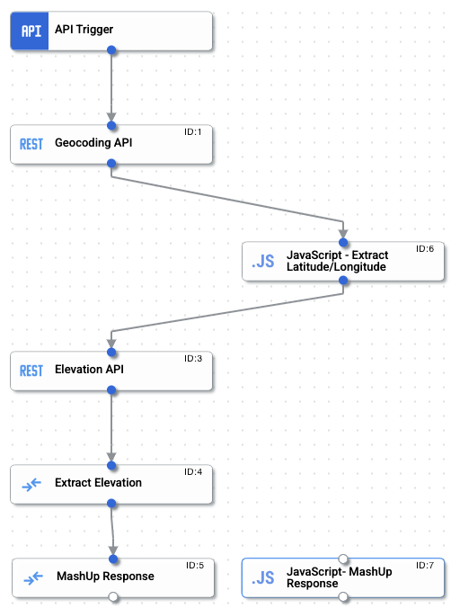
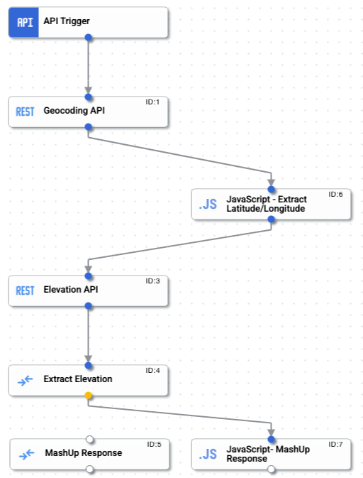
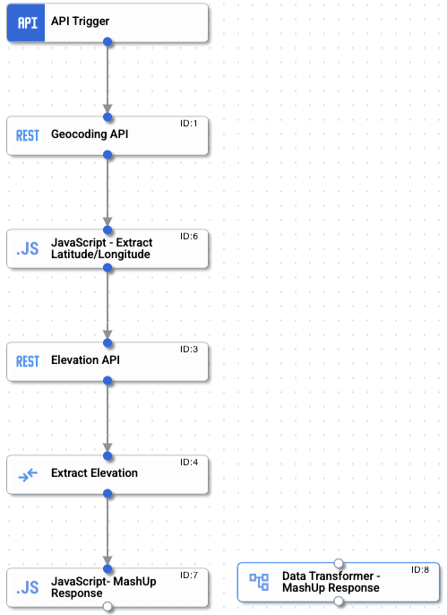
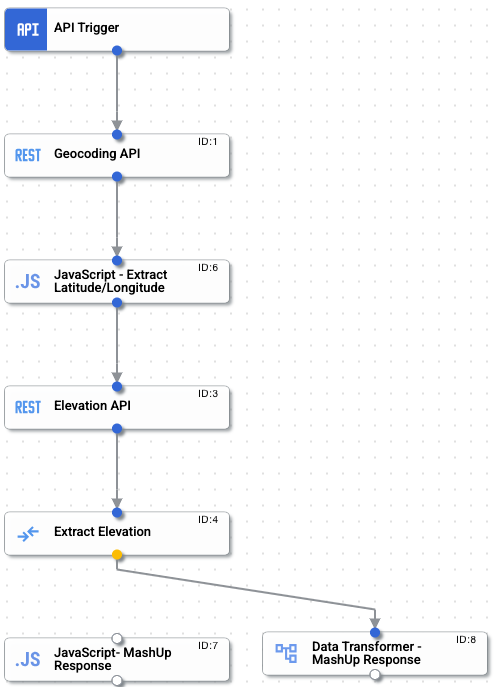
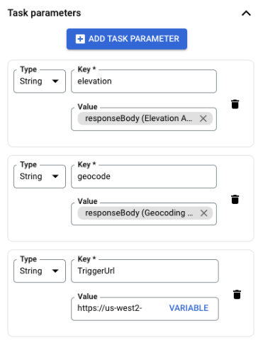

# Data Manipulation

In this lab, we will explore different ways of handling the response and mashing them up using 
- Data Mapper Task
- JavaScript Task
- DataTransformer Task

## Google Maps API Key

1. Login to your GCP console, select your GCP project
2. Enable the Google Maps API. Set the PROJECT_ID env variable
   ```sh
    export PROJECT_ID=<project>
    gcloud services enable \
    --project "$PROJECT_ID" \
    "elevation-backend.googleapis.com" \
    "geocoding-backend.googleapis.com" \
    "geolocation.googleapis.com"
   ```
3. Using the left menu, navigate to `APIs & Services --> Credentials`
4. Click `+ CREATE CREDENTIALS`
5. Select `API Key`
6. Copy the API Key generated to your clipboard and paste it in some editor as we will be using in the sections below

## Data Mapper Task

1. Create an Integration and name it `<prefix>-MashUp`
2. From the cloned repo in your machine, go to `data-manipulation` directory and Upload the `MashUp.json` file to the newly created integration

    

3. Once uploaded, you should see integration with all the tasks created and all set
    
    

4. On the left pane, under `Local Variables`, click the variable action next to the variable `key` and select `View Details`
    

5. Replace the `replace-me` default value with the Google Maps API key you generated in the step above. Click **SAVE**
    

6. Click **Publish** and **Test**. Provide an address or code in the input field, for example `94539`. You should get a valid response.
7. In this sample, we are making calls to the Maps Geocoding API, extract the geometric coordinates from its response and then use that to get the elevation using the Maps Elevation API
8. Finally, a DataMapper Task to mash the responses from both the API calls

There could be scenarios where the DataMapper could be difficult to use. This is where other tasks like JavaScript and DataTransformer tasks come handy. 


## JavaScript Task

Now let’s update this integration to use a JavaScript task instead of the DataMapper task. 

1. Click “Enable Editing” on the published integration
2. Add a new JavaScript task and label it as `JavaScript - Extract Latitude/Longitude`

    

3. Now Click the `Open Script Editor` and paste the following code
   ```javascript
    /**
    * Function that is called during the JavaScript Task execution.
    * @param {IntegrationEvent} event
    */
   function executeScript(event) {
       var geoCodeResponse = JSON.parse(event.getParameter("`Task_1_responseBody`"));
       var latitude = geoCodeResponse.results[0].geometry.location.lat;
       var longitude = geoCodeResponse.results[0].geometry.location.lng;
       var fomattedAddress = geoCodeResponse.results[0].formatted_address;
       event.setParameter("latitude", latitude);
       event.setParameter("longitude", longitude);
       event.setParameter("fomattedAddress", fomattedAddress);
       event.setParameter("locations", latitude+","+longitude);
   }
   ```
4. Once copied, click the back button to go back to the main Integration designer view. Now detach the Data Mapper Task and connect to the newly created JavaScript Task

    

5. Delete the old `Extract Latitude/Longitude` Data Mapper task 
6. Now click `Test` to see if the response is still valid
7. Now, lets update the MashUp Response Data Mapper task to a JavaScript task
8. Add a new JavaScript task and label it as `JavaScript - MashUp Response`

    

9. Now click the `Open Script Editor` and paste the following code
    ```javascript
    /**
    * Function that is called during the JavaScript Task execution.
    * @param {IntegrationEvent} event
    */
   function executeScript(event) {
       var elevation = event.getParameter("elevation");
       var elevationFeet = elevation * 3.2808399
       
       var mashUpResponse = {
           address: event.getParameter("fomattedAddress"),
           elevation: {
               meters: elevation,
               feet: elevationFeet
           },
           location: {
               latitude: event.getParameter("latitude"),
               longitude: event.getParameter("longitude")
           }
       };

       event.setParameter("mashUpResponse", mashUpResponse);

   }
    ```
10. Click back and now in the Integration designer view, detach the Data Mapper Task and connect to the newly created JavaScript Task

    

11. Delete the old `MashUp Response` Data Mapper task
12. Now click `Test` to see if the response is still valid
13. Click the Clean up graph button 
14. Click Publish and test again


## Data Transformer Task

Now let’s update this integration to use a DataTransformer task instead of the JavaScript task. 

1. Click `Enable Editing` on the published integration
2. Add a new Data Transformer task and label it as `Data Transformer - MashUp Response`

    

3. Click `Open Data Transformer Editor` and paste the following code

    ```sh
    // Import the additional functions library
    local f = import "functions";

    local geocodeInput = std.parseJson(f.extVar("`Task_1_responseBody`"));
    local elevationInput = std.parseJson(f.extVar("`Task_3_responseBody`"));
    local elevation = elevationInput.results[0].elevation;
    local elevationInFt = elevation * 3.2808399;

    {
    "mashUpResponse": {
        "address": geocodeInput.results[0].formatted_address,
        "elevation": {
            "meters": elevation,
            "feet": elevationInFt
        },
        "location": {
            "latitude": geocodeInput.results[0].geometry.location.lat,
            "longitude": geocodeInput.results[0].geometry.location.lng
        }
        }
    } 
    ```

4. Click Back and in the Integration designer view, detach the JavaScript Task and connect to the newly created DataTransformer Task
   
    

5. Delete the JavaScript Task
6. Click `Publish` and test the integration

## Extra Credits: Cloud Functions Task

Now let’s try using the Cloud Functions Task

1. Click `Enable Editing` on the published integration
2. Add a new Cloud Functions task and label it as `Cloud Functions - MashUp Response`
3. Click on `Configure Cloud Function` in the script editor
4. Click `Create new function`.  Name the function `prefix-cfmashup`
5. You can open the new function created in a new browser tab
6. In the task, add two new Task parameters (geocode and elevation)
   
    **NOTE:** DO NOT update the TriggerURL Parameter

    | Parameter 1 | Parameter 2 |
    |-------------|-------------|
    | Key: **elevation** | Key: **geocode** |
    | Type: **String** | Type: **String** |
    | Value: **responseBody (Elevation API)** | Value: **responseBody (Geocoding API)** |

    


7. In the Cloud Functions, in the task.py file, paste the following code
    ```py
    import json

    def run(event):

        geocodeInput = json.loads(event.get('geocode'))
        elevationInput = json.loads(event.get('elevation'))

        response = {
            "address": geocodeInput["results"][0]["formatted_address"],
            "elevation": {
                "meters": elevationInput["results"][0]["elevation"],
                "feet": elevationInput["results"][0]["elevation"] * 3.2808399
            },
            "location": {
                "latitude": geocodeInput["results"][0]["geometry"]["location"]["lat"],
                "longitude": geocodeInput["results"][0]["geometry"]["location"]["lng"]
            }
        }

        event.set('mashUpResponse', response);

        return
    ```

8. Save and deploy the Cloud Function
9.  Go back to the Integration, detach the Data Transformer Task and attach it to the new Cloud Function task

    

10. Delete the Data Transfomer Task
11. Click Publish and Test the integration

