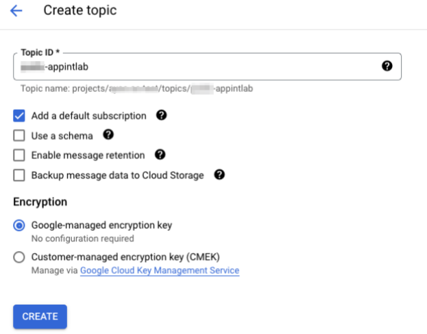
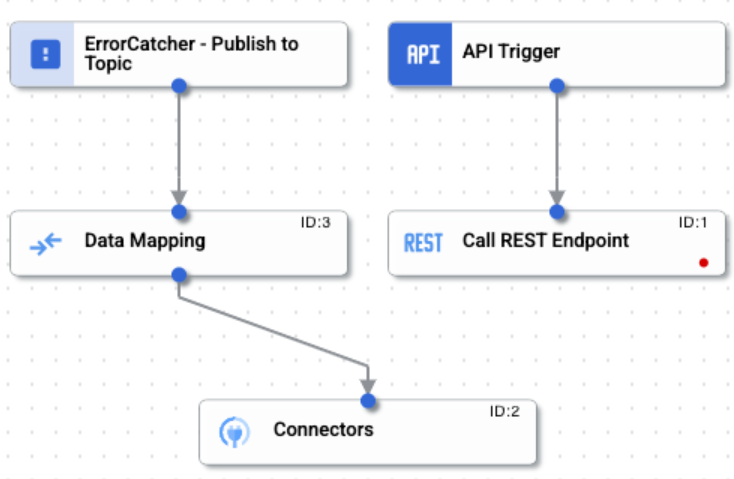
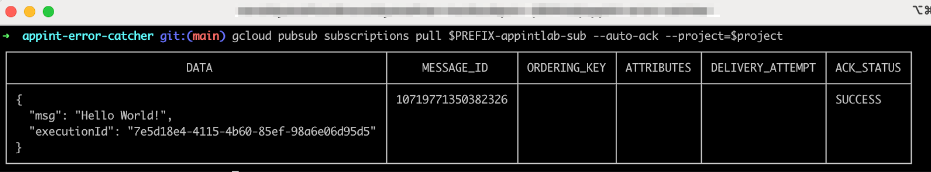

# Error Catcher Lab

In this lab, we will demonstrate how Error Catcher Trigger can be used. We will be publishing an existing integration to Application Integration using [integrationcli](https://github.com/GoogleCloudPlatform/application-integration-management-toolkit). The sample will generate an error and which will trigger the Error Catcher and then request is published to a Pub/Sub using the connector

## Pre-req
1. Install [gcloud SDK](https://cloud.google.com/sdk/docs/install)
2. Install [integrationcli](https://github.com/GoogleCloudPlatform/application-integration-management-toolkit)
    ```
    curl -L https://raw.githubusercontent.com/GoogleCloudPlatform/application-integration-management-toolkit/main/downloadLatest.sh | sh -
    
    export PATH=$PATH:$HOME/.integrationcli/bin
    ```
    Run `integrationcli --version` to make sure its installed correctly

3. A GCP Project with Application Integration and Integration Connectors already enabled
4. Roles to create/publish Integrations and create connectors

## Create Pub/Sub Topic

For this lab, we will create a Pub/Sub topic
- Go to the Pub/Sub topics page in the [Cloud console](https://console.cloud.google.com/)
- Click Create a topic
- In the Topic ID field, provide a unique topic name. e.g `<prefix>-appintlab`. The prefix could be your username, ldap, initials, etc
- Click Create

    

## Setup

1. In your terminal, go to the directory where you cloned the lab repo
    ```sh
    cd labs/error-catcher
    ```
2. In your terminal, set the `PREFIX` variable with the same prefix you used to create the Pub/Sub Topic above

    ```sh
    export PREFIX=<prefix>
    export PROJECT_ID=$(gcloud config get-value project)
    export REGION=<region>
    ```

    and then update the configuration files to use the prefix

    ```sh
    sed -i "s/PREFIX/$PREFIX/g" ./dev/config-variables/prefix_ErrorCatcher-config.json
    sed -i "s/PROJECT_ID/$PROJECT_ID/g" ./dev/config-variables/prefix_ErrorCatcher-config.json
    sed -i "s/PREFIX/$PREFIX/g" ./dev/connectors/prefix-appintlab-pubsub-connector.json
    sed -i "s/PREFIX/$PREFIX/g" ./dev/overrides/overrides.json
    sed -i "s/ErrorCatcher_API_1/${PREFIX}_ErrorCatcher_API_1/g" ./src/ErrorCatcher.json
    sed -i "s/PREFIX/$PREFIX/g"  ./src/ErrorCatcher.json
    sed -i "s/project_id/${PROJECT_ID}/g" ./src/ErrorCatcher.json
    sed -i "s/prefix-appintlab/${PREFIX}-appintlab/g" ./src/ErrorCatcher.json
    sed -i "s/region/${REGION}/g" ./src/ErrorCatcher.json
    ```
3. Rename connector and integration json files

    ```sh
    mv ./dev/connectors/prefix-appintlab-pubsub-connector.json ./dev/connectors/${PREFIX}-appintlab-pubsub-connector.json
    mv ./src/ErrorCatcher.json ./src/${PREFIX}_ErrorCatcher.json
    mv ./dev/config-variables/prefix_ErrorCatcher-config.json ./dev/config-variables/${PREFIX}_ErrorCatcher-config.json
    ```

4. Set the Integration Preferences

    ```sh
    TOKEN=$(gcloud auth print-access-token)
    integrationcli preferences set -r $REGION -p $PROJECT_ID -t $TOKEN
    ```

5. Create the Integration and Connectors using the integrationcli apply command

    ```sh
    integrationcli integrations apply -f . -e dev --wait=true --sa=$PREFIX-error-catcher-svc --grant-permission=true
    ```

6. Once the `<prefix>_ErrorCatcher` Integration is created and published, click "Test". Please note, the Connector could take a few mins to activate

    

7. In a terminal, run the following command to see if the message is published to your topic

    ```sh
    gcloud pubsub subscriptions pull $PREFIX-appintlab-sub --auto-ack --project=$PROJECT_ID
    ```

    

    You can check the same in the GCP console as well

    
