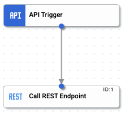

# mtls-auth

This lab will cover how to configure an Auth profile with certificate to integrate with an mTLS enabled API

1. Create an Integration and name it `<prefix>-mtLS`. The prefix could be your username, ldap, initials, etc
2. Add an API Trigger and then a REST Task. Connect them to each other

    

3. Click the REST Task and in the config Panel (Endpoint base URL), configure https://`<your instructor will provide>`  as the URL leaving the others as default
4. Click “Test” - what do you see?
5. The Integration should fail with “400 BAD REQUEST” with description “Invalid or missing client certificate”. This is because the REST API is expecting a valid certificate to be passed as well
6. Download the cert and key files to your local machine
    ```sh
    curl -o cert.pem https://<your instructor will provide>
    curl -o key.pem https://<your instructor will provide>
    ```
7. Click the `Auth Profiles` from the left menu and make sure you selected the correct region from the drop down and then click `+ CREATE`

|  Parameter | Value |
|--------------------|--------------------|
|  Auth Profile Name | `<prefix>-mtLS-Auth` |
| Authentication profile visibility | Visible to all project members |
| Authentication type | SSL/TLS Certificates only |
| Files | Upload the cert.pem and key.pem for SSL Cert and Key respectively from your local machine |

8. Click “Save” (NOTE: This could take a few seconds)
9. Go back to the Integration (enable editing) and click the REST Task to add the Auth Profile
10. Now click the “Test” button, what do you see? Should be a valid response

    