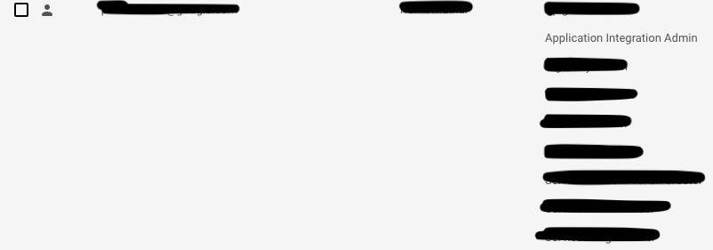
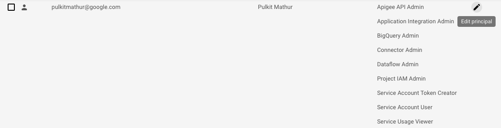
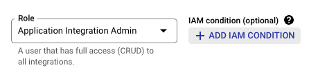
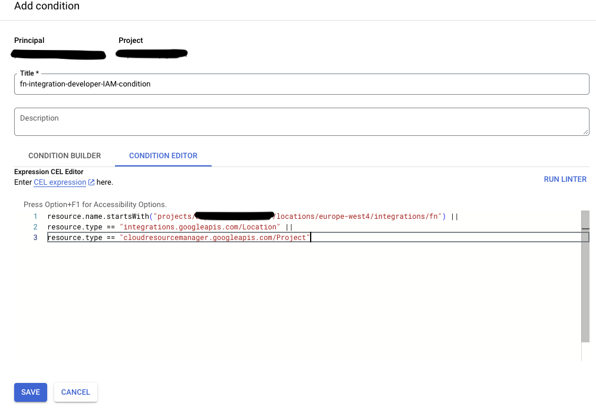
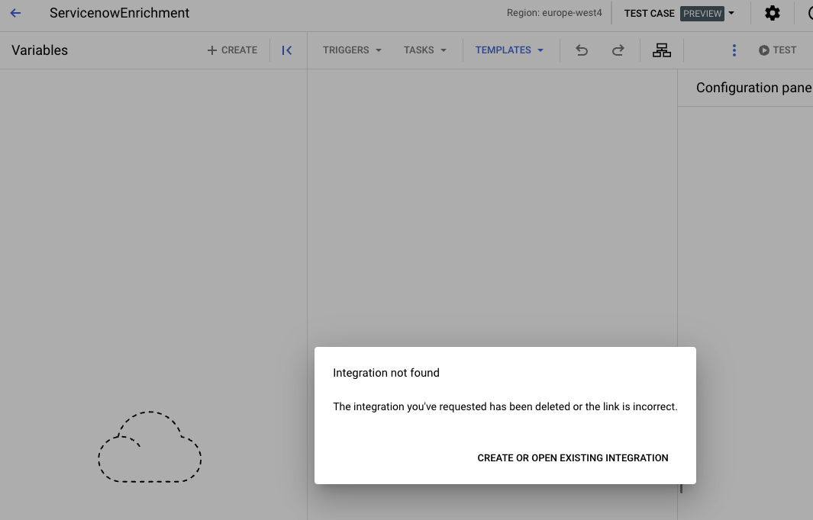
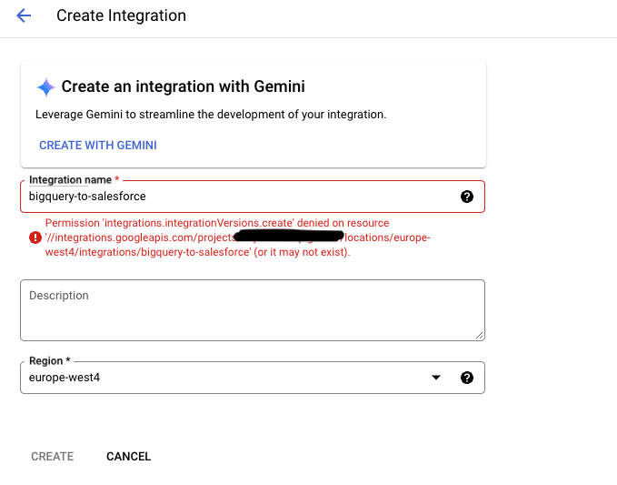

# IAM Best Practices

Application Integration, like all GCP products, supports "roles" which can be used to develop/deplo/manage integrations. The IAM roles currently supported by Application Integration are at https://cloud.google.com/application-integration/docs/predefined-iam-roles-permissions

In addition to providing users with specific roles, it might be necessary to enable greater granualar access on integrations. This is done using IAM conditions. Documentation on using IAM conditions within Application Integration is at https://cloud.google.com/application-integration/docs/add-iam-conditions.

Let's take an example. Suppose we have 10 domain teams developing integrations, and developers from each domain should only be able to create and manage integrations related to their domain. This can be achieved by enabling an IAM condition on the developer principals in GCP IAM.

Before we get started with IAM connditions, it is important to enable a naming convention for our integration. A naming convention that is often used if <domain>-<sourcesystem>-<targetsystem>. Thus if there are multiple domain teams like finance, procurement, supplychain etc. building integrations in the same GCP project, having a naming comnvention can enable them to search for domain integrations more effectively, and secondly enable IAM conditions.

## Overview

In this lab, we will create an IAM conditions for a user who has the role of "integrations.integrationAdmin". Currently, the user can access all integrations in the GCP project, and our target is to only limit access to integrations to a developer from the finance domain. The integrations related to the finance domain start with "fn".

The current permissions for the user can be seen in the below screenshot:

## Create an IAM condition

Create an integration with the name starting with "fn", such as "fn-servicenow-salesforce" and an integration whose name does not start with "fn", such as "ServicenowEnrichment".

## Create a new IAM policy

Create a new integration by  performing the following steps:

1. In the Google Cloud console, go to the IAM page.
2. In the navigation menu, go to the user/principal for whom access is to be limited, and click "Edit Principal"

3. On the next page, click "ADD IAM CONDITION", next to the "Application Integration Admin" role

4. On the next page, create the IAM condition as follows:

resource.name.startsWith("projects/<project>/locations/<location>/integrations/fn") ||
resource.type == "integrations.googleapis.com/Location" ||
resource.type == "cloudresourcemanager.googleapis.com/Project"

5. Go back to the Integrations and try to access the integration "ServiceNowEnrichment". The integration is not accessible, whereeas the integration "fn-servicenow-salesforce" is still accessible.

6. Now, try creating an integration named "bigquery-to-salesforce", and you would receive an error about not having sufficient permissions. However, creating an integration called "fn-bigquery-to-salesforce" is possible according to the IAM condition created previoulsy.

