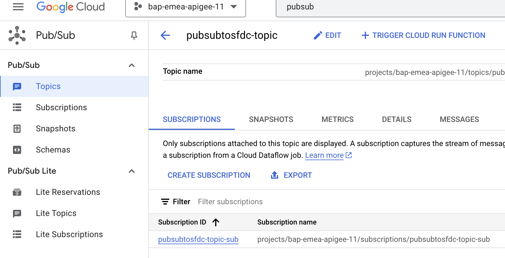
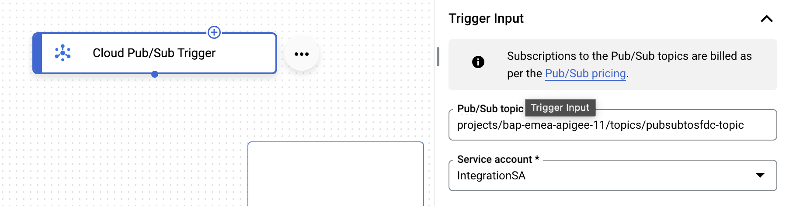
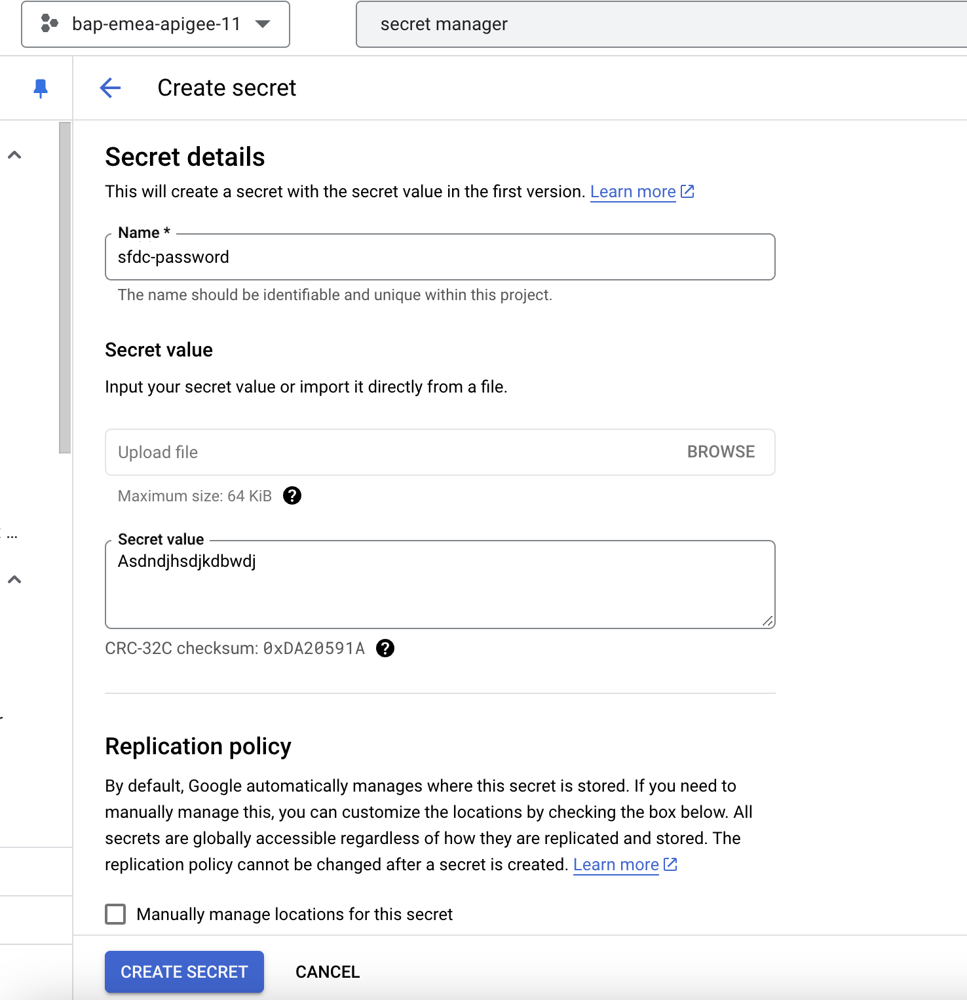
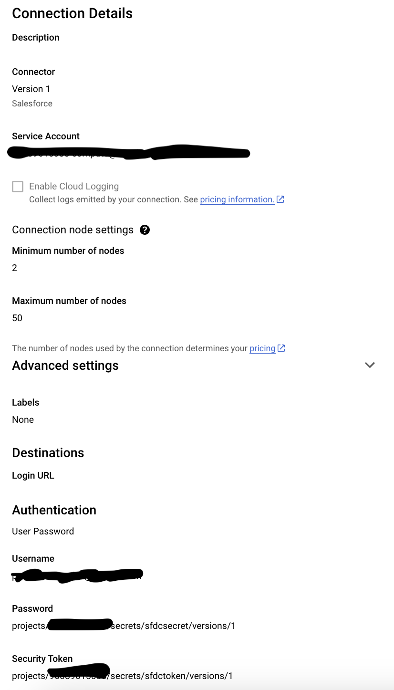
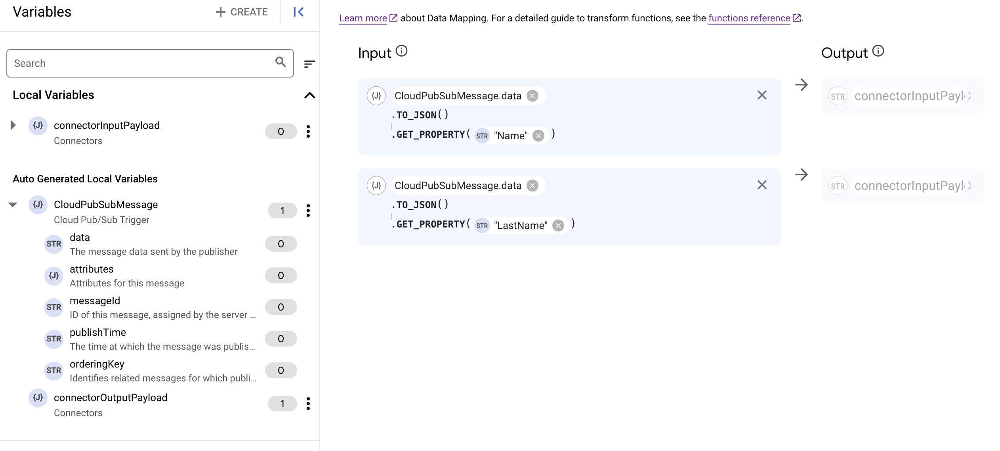

# Pub/Sub Trigger, Data Mapping and Salesforce insert

This lab will cover the steps to create a sample integration using Application Integration and the Cloud Pub/Sub trigger. Some other Integration Concepts covered in this exercise include -
- Create & Configure a Cloud Pub/sub Trigger
- Configure tasks, variables
- Create a Data mapping
- Create an Integration
- Create a Salesforce connection

## Overview

You will create an integration with a Cloud Pub/Sub trigger to listen to an existing Pub/Sub topic that receives contact information. This contact information would be transformed to Salesforce's format using data mapper and a contact in Salesforce would be created. 

## Before you begin

Ensure your IAM user has the following GCP roles/permissions in your Google Cloud project.
- Pub/Sub Editor
- Application Integration Invoker

## Set up environment

For this lab, we will create a Pub/Sub topic that receives temperature readings in degrees Kelvin from an IOT device. This quickstart tests the integration's ability to listen to the topic and perform tasks when triggered.
1.  Go to the Pub/Sub topics page in the Cloud console
2.  Click Create a topic. 
3.  In the Topic ID field, provide a unique topic name.
4.  Click Create

## Create a New Integration

Create a new integration by  performing the following steps:

1. In the Google Cloud console, go to the Application Integration page.
2. In the navigation menu, click Integrations. The Integrations List page appears.
3. Click **Create** integration.
4. Enter a name and description in the Create Integration dialog. For example, `pubsubtosfdcintegration`. Replace the prefix with an appropriate value similar to the prefix you used in the above step while creating the Topic
5. Select a region for the integration
6. Click Create to open the integration editor
7. Enable logs to be sent to cloud logging by clicking on the gear icon  at the top-right of the integration and a menu with integration details should appear as in the below screenshot
8. Drag the slider to the right to Enable Cloud Logging (to send Execution Logs to Cloud Logging)

## Create and Configure a Cloud Pub/Sub trigger

To add a Cloud Pub/Sub trigger to the integration, follow the steps below:
1. In the integration editor, select Triggers to display a list of available triggers.
2. Click and place the Cloud Pub/Sub trigger element to the designer.
3. Click the Cloud Pub/Sub trigger element in the integration editor to view the trigger configuration pane.
4. Specify the topic the trigger should listen to in the Pub/Sub topic field - `projects/{projectID}/topics/`
5. Select an existing service account or create a new service account. Click the **GRANT** button to assign the appropriate permissions
6. See screenshot below

## Create the Salesforce connector

1. Go to "Secrets Manager" and create two secrets, sfdcsecret and sfdctoken with the values provided by the instructor.

2. Add a connector task and click "Configure Connector"

3. Click "Create Connection" and select Salesforce.

4. The final connection should look like this(use the username provided the instructor and the secrets created previously):

5. Go back to the integration, select the connector and click "Configure connector" again. This time, select the connector just created and configure it as follows:

## Create a Data Mapping

1. Add and configure the Data Mapping task. To configure the Data Mapping task:
    - Select Tasks to display a list of available tasks.
    - Click and place the Data Mapping element in the integration editor
    - Click on the Data Mapping task on the designer to open the configuration pane for the task
    - Click Open Data Mapping Editor
    - Create a mapping using the CloudPubSubMessage as input:
      - Expand the CloudPubSubMessage JSON variable in the Variables list and drag the CloudPubSubMessage.data variable to the first Input row
      - Click + (Add a function) next to the CloudPubSubMessage.data variable to view the drop-down list of available functions
      - Select TO_JSON() to convert the CloudPubSubMessage.data value to a JSON and add the function GET_PROPERTY
      - Click `Variable or Value` and then click `Value` section on the left. Now select "String" from the drop down and Enter `Name` as the value. This is to extract the Name value from the JSON we well get from the pub/sub topic
        
      - Click the first row in the Output column and drag and drop connctorInputPayload.FirstName
      - Similarly, configure the LastName mapping

### Test the integration
To test the new integration from the Pub/Sub topics page, do the following steps:
- Go to the Pub/Sub topics page in the Cloud console
- Search for and then select the topic that you created.
- From the "MESSAGES" section of the topic details page, click + Publish Message to open the Publish Message configuration pane.
- In the Message body field, enter:
  {
    "Name": "<yourfirstname>",
    "LastName": "<yourlastname>"
  }
- Click Publish to publish the message to the topic and trigger your integration.

Upon successful completion, the integration inserts a contact in Salesforce.

