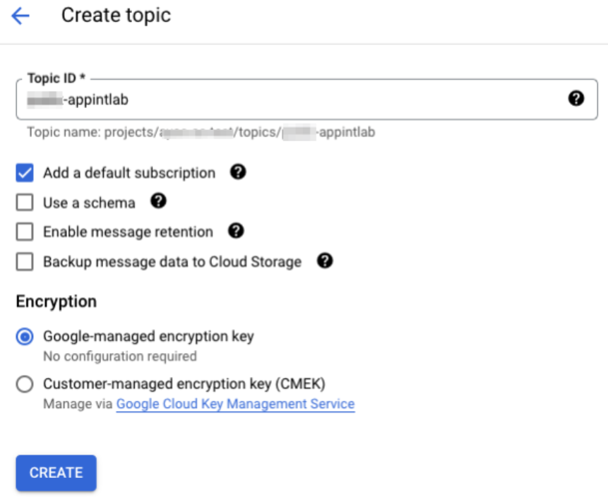
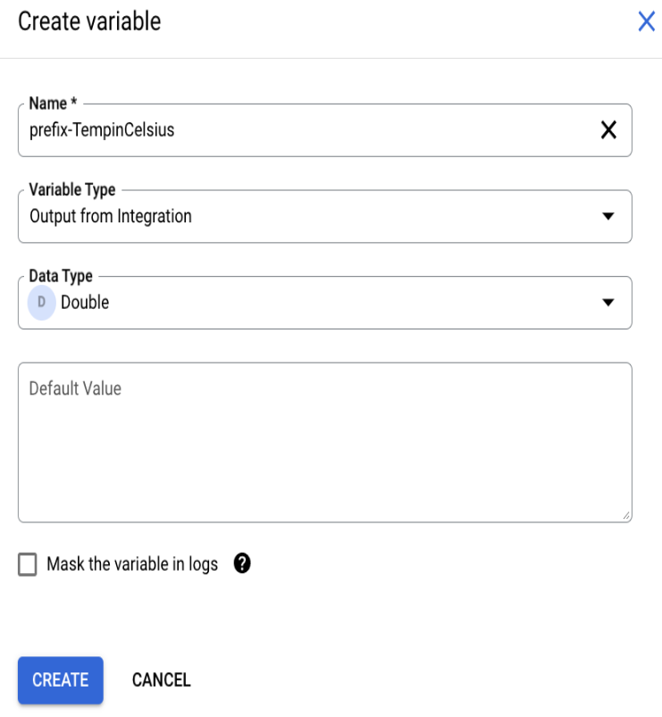
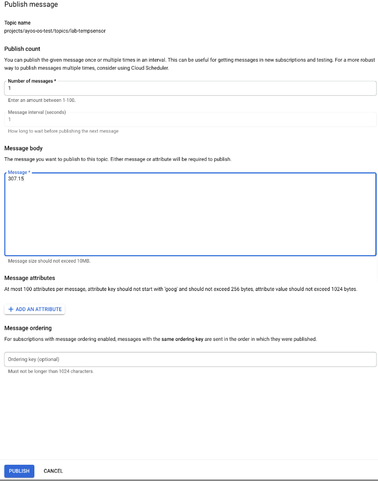

# Pub/Sub Trigger, Data Mapping and Execution Logs

This lab will cover the steps to create a sample integration using Application Integration and the Cloud Pub/Sub trigger. Some other Integration Concepts covered in this exercise include -
- Create & Configure a Cloud Pub/sub Trigger
- Configure tasks, variables
- Create a Data mapping
- Create an Integration
- Viewing Execution Logs
- Viewing Audit Logs

## Overview

You will create an integration with a Cloud Pub/Sub trigger to listen to an existing Pub/Sub topic that receives temperature readings in degrees Kelvin from a IOT device. You can then use the Data Mapping task to transform the Pub/Sub message to celsius and send the value in an email.

## Before you begin

Ensure your IAM user has the following GCP roles/permissions in your Google Cloud project.
- Pub/Sub Editor
- Application Integration Invoker

## Set up environment

For this lab, we will create a Pub/Sub topic that receives temperature readings in degrees Kelvin from an IOT device. This quickstart tests the integration's ability to listen to the topic and perform tasks when triggered.
1.  Go to the Pub/Sub topics page in the Cloud console
2.  Click Create a topic. 
3.  In the Topic ID field, provide a unique topic name. e.g <prefix>-appintlab. The prefix could be your username, ldap, initials, etc
4.  Click Create



## Create a New Integration

Create a new integration by  performing the following steps:

1. In the Google Cloud console, go to the Application Integration page.
2. In the navigation menu, click Integrations. The Integrations List page appears.
3. Click **Create** integration.
4. Enter a name and description in the Create Integration dialog. For example, `<prefix>-integration`. Replace the prefix with an appropriate value similar to the prefix you used in the above step while creating the Topic
5. Select a region for the integration
6. Click Create to open the integration editor
7. Enable logs to be sent to cloud logging by clicking on the gear icon  at the top-right of the integration and a menu with integration details should appear as in the below screenshot
8. Drag the slider to the right to Enable Cloud Logging (to send Execution Logs to Cloud Logging)

## Create and Configure a Cloud Pub/Sub trigger

To add a Cloud Pub/Sub trigger to the integration, follow the steps below:
1. In the integration editor, select Triggers to display a list of available triggers.
2. Click and place the Cloud Pub/Sub trigger element to the designer.
3. Click the Cloud Pub/Sub trigger element in the integration editor to view the trigger configuration pane.
4. Specify the topic the trigger should listen to in the Pub/Sub topic field - `projects/{projectID}/topics/<prefix>-appintlab`
5. Select an existing service account or create a new service account. Click the **GRANT** button to assign the appropriate permissions
6. See screenshot below


## Create a Data Mapping

1. Add and configure the Data Mapping task. To configure the Data Mapping task:
    - Select Tasks to display a list of available tasks.
    - Click and place the Data Mapping element in the integration editor
    - Click on the Data Mapping task on the designer to open the configuration pane for the task
    - Click Open Data Mapping Editor
    - Create a mapping using the CloudPubSubMessage as input:
      - Expand the CloudPubSubMessage JSON variable in the Variables list and drag the CloudPubSubMessage.data variable to the first Input row
      - Click + (Add a function) next to the CloudPubSubMessage.data variable to view the drop-down list of available functions
      - Select TO_DOUBLE() to convert the CloudPubSubMessage.data value to a data type of double
      - Click + (Add a function) again to select and chain the SUBTRACT function
      - Click `Variable or Value` and then click `Value` section on the left. Now select "Double" from the drop down and Enter `273.15` as the SUBTRACT function value. This is to convert the Kelvin temperature to degrees Celsius. ( See screenshot below)
        
      - Click the first row in the Output column to create a new output variable to hold the value of the transformed data. Complete the following fields:
        - Name: Enter `prefix-TempInCelsius`
        - From the Variable Type drop-down select “Output from integration”
        - Click Create to create the variable and close the pane
        
        - The new prefix-TempInCelsius variable will appear in the Variables list
      - Drag the prefix-TempInCelsius variable from the Variables list to the second row in the Input column
      - Click + (Add a function) in the prefix-TempInCelsius variable to view the drop-down list of available functions
      - Click TO_STRING() to transform the data type of the variable from double to string
      - Click the second row in the Output column to create a new variable to hold the value of the transformed data. Complete the following fields:
        - Name: `prefix-TempinCelsiusString`
        - Blank default value means: Select : ”Empty String”
        - Within the Variable Type drop-down select the “Output from Integration” option
        - Click Create to create the variable and close the pane. The new variable will appear in the Variables list on the left side of the data mapping editor
      - Confirm your data mapping is as below and exit by clicking the `<-` button on the top left
        

## Creating a Send Email task

To configure the Send Email task:

1. Select Tasks in the integration editor 
2. Click and place the Send Email element in the integration editor
3. Click the Send Email element on the designer to open the configuration pane of the task. Set the following properties:
   1. To Recipient(s): Enter your email address. You will use this email to confirm the successful completion of the integration.
   2. Subject: Enter Temperature in Celsius.
   3. Body in Plain Text: Select the prefix-TempInCelsiusString variable created earlier in the Data Mapping task.
   4. The remaining options can be left in the default configuration.

Add the required edge connections 
   - Add an edge connection from the Cloud Pub/Sub trigger element to the Data Mapping element 
   - Add an edge connection from the Data Mapping element to the Send Email element by hovering over a control point on the Data Mapping element, then clicking and dragging a line to a control point on the Send Email task element. 
   - Click **PUBLISH** to publish the integration

The completed connection should appear as shown in the figure below:


### Test the integration
To test the new integration from the Pub/Sub topics page, do the following steps:
- Go to the Pub/Sub topics page in the Cloud console
- Search for and then select the `prefix-appintlab` topic that you created.
- From the topic details page, click + Publish Message to open the Publish Message configuration pane.
- In the Message body field, enter `307.15`
- Click Publish to publish the message to the topic and trigger your integration.



Upon successful completion, the integration sends an email with the Kelvin temperature converted to degrees Celsius to the email address specified in the Send Email task. Confirm receipt of the email in your email client.
The email sent by the integration should have a message body containing the value `34.0`.
In addition to verifying the contents of the email, you can inspect the logs to view the status and payload of a given integration.

## View Execution Logs

- In the integration editor, click  to  View execution logs for this integration. The Execution Logs page appears. For more information about execution logs, see [View integration execution logs](https://cloud.google.com/application-integration/docs/integration-execution-logs#view-integration-execution-logs).
- On the Execution Logs page, you can view details about each attempt to run an integration. Each entry includes details for the execution attempt, including as shown below :
  - Integration name
  - Execution ID
  - Status
  - Start time
  - Duration
  - Integration Version
  - Trigger ID


## View Integration Execution Logs in Cloud Logging

1. Follow these steps to view the Integration execution logs by "integration name”
2. In the navigation panel of the Google Cloud console, select Logging, and then select Logs Explorer
3. Note that Logs are displayed for the last three hours for the default query -
    ```
    resource.type=integrations.googleapis.com/IntegrationVersion
    ```
4. View the integration execution log in cloud logging by inserting the following query in the log query tool
   ```
    resource.type="integrations.googleapis.com/IntegrationVersion" jsonPayload.integration="integration name"
   ```
   Click “Run Query” and the output should be similar to the below screenshot

   