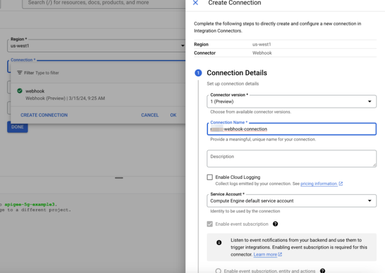
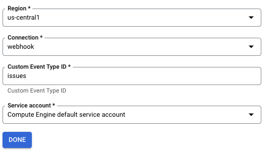
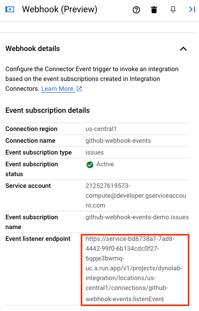
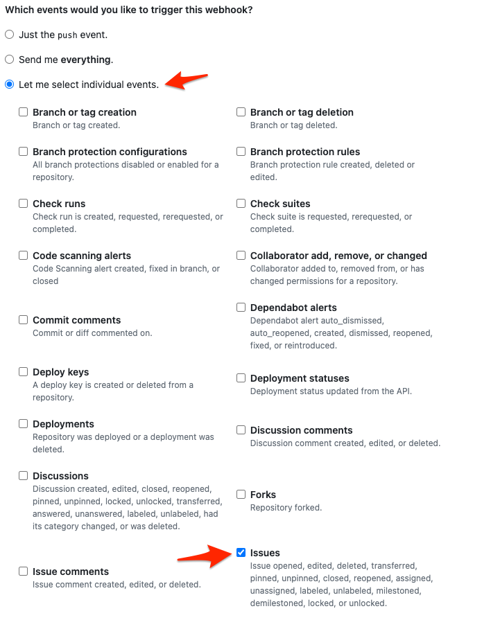

# Webhook Trigger

In this demo, we will use the Webhook Connector to trigger an integration. 

## Create Webhook Trigger

1. In the Google Cloud console, go to the Application Integration page. [Go to Application Integration](https://console.cloud.google.com/integrations)
2. In the navigation menu, click Integrations. The Integrations List page appears listing all the integrations available in the Google Cloud project.
3. Select an existing integration or click Create integration to create a new one. If you are creating a new integration:
   1. Enter a name `<prefix>-webhook-trigger` and description in the Create Integration pane
   2. Select a region for the integration
   3. Click Create
4. This opens the integration in the integration editor
5. In the integration editor navigation bar, click Triggers to view the list of available triggers
6. Click and place the Webhook trigger element in the integration editor.

To configure the **Webhook trigger**, you can either use an existing Webhook connection available in Integration Connectors, or create a new Webhook connection using the inline connection creation option

## Configure New Webhook Connection

To configure the Webhook trigger using a new Webhook connection, perform the following steps
1. Click the Webhook trigger in the integration editor to open the trigger configuration pane
2. Click Configure trigger
3. Skip the Region field (make sure its the same as the region of the integration)
4. Click Connection and select the Create Connection option from the menu
5. Complete the following steps in the Create Connection pane:
   1. In the Connection Details section, complete the following:
      1. **Connector version:** Select the Connector version from the drop down list of available versions.
      2. **Connection Name:** Enter a name `<prefix>-webook-connection` for the Connection instance
      3. **Description:** Optionally, enter a description for the connection instance.
      4. **Service Account:** Select a service account that has the [required roles](https://cloud.google.com/application-integration/docs/configure-webhook-trigger#before-you-begin).
      5. **Event Subscription:** Event subscription will be enabled by default and is mandatory for webhook connector
      6. Optionally, click `+ Add label` to add a label to the Connection in the form of a key/value pair.
      7. Click Next

        

   2.  In the Event Subscription Details section, complete the following:
       1.  **Listener Authentication:** Select an authentication type for the event listener and enter the relevant details. For the demo use **No Authentication**
       2.  **Event Type Field Location:** Select `Header` from the drop down
       3.  **Event Type Field Name:** `X-GitHub-Event`
       4.  In the configuration above, the field signifies that the request pertains to an event.
       5.  Keep others as default
       6.  Click Next

        

   3.  **Review:** Review your connection and listener authentication details.
   4.  Click Create. This can take a few minutes.
6.  With the Connection created, let's provide the following configuration details in the Connector Event Trigger Editor page:
    1.  **Region:** Select the region of your Webhook connection.
    2.  **Connection:** Select the Webhook connection that you want to use. Application Integration only displays those Webhook connections that are active and have an event [subscription](https://cloud.google.com/integration-connectors/docs/eventsubscription) enabled.
    3.  **Event subscription type:** Enter the type of event that you want to use to trigger the integration. Type `issues`
    4.  **Service Account:** Select a service account with the [required IAM roles](https://cloud.google.com/application-integration/docs/configure-webhook-trigger#iam) for the Webhook trigger.
    5.  Press Done.
   
    

    Back to the main Integration Designer view

    

    Note down the event listener endpoint.  In this case its https://service-bd8738a1-7ad8-4442-99f0-6b134cdc0f27-6qpje3bwmq-uc.a.run.app/v1/projects/dynolab-integration/locations/us-central1/connections/github-webhook-events:listenEvent

7. Add SendEmail Task in the integration page and connect it to the Webhook Trigger. Configure the following:
    - **To Recipent**: Your email address
    - **Subject**: GitHub Webhook Trigger
    - **Body**: Select the variable `ConnectorEventPayload_1`

    

8. Publish the Integration. Use curl to test it 
    ```sh
    curl -X POST \
        -H "X-GitHub-Event: issues" \
        https://YOUR_EVENT_LISTENER_URL \
        -d '{"event_type" : "issue created"}'
    ```

9.  You should receive an email. You can also check the execution logs

### Extra Credits

Let's configure this as a callback event in GitHub to see this end to end

1. Login to your GitHub org and go to one of your personal respositories
2. Click the `Settings` and select `Webhooks` from the left menu
3. Click `Add Webhook`
4. In the Payload URL, provide the event listener URL endpoint (used in the above cURL)
5. Select `appliction/json` as the Content Type
6. Under the *Which events would you like to trigger this webhook?* section, select the `Let me select individual events` and then select `issues` from the options. 



6. Uncheck the other options
7. Click `Add webhook`
8. Go to the repo and create a new issue


9. Click `Submit new issue`
10. WHAT DO YOU SEE? Did you get the email with the entire payload?

**NOTE:** After testing, make sure you go ahead and delete the Webhook in GitHub